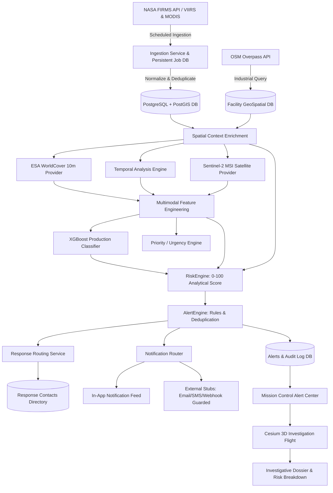
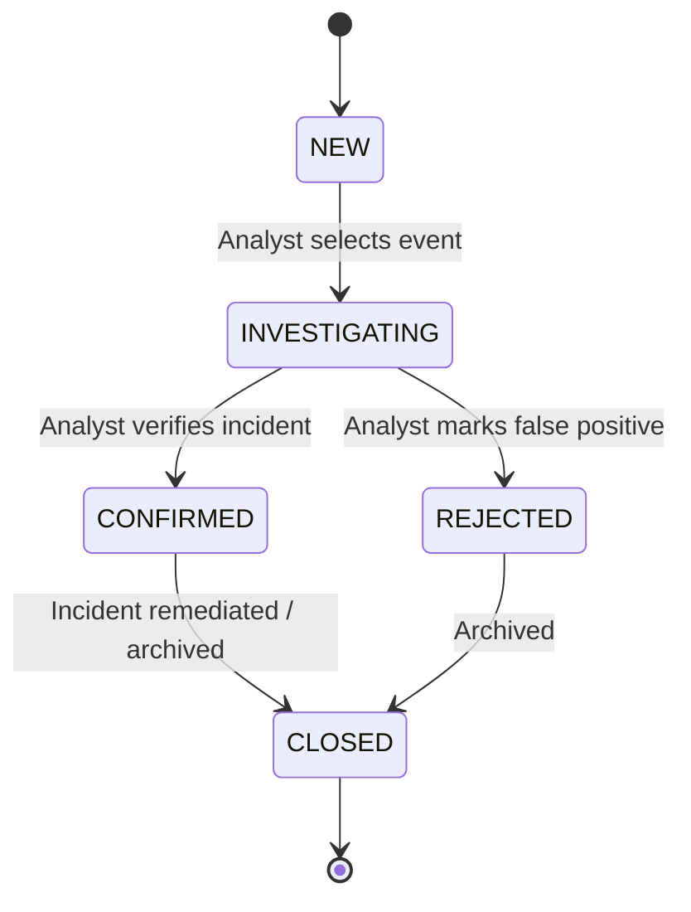
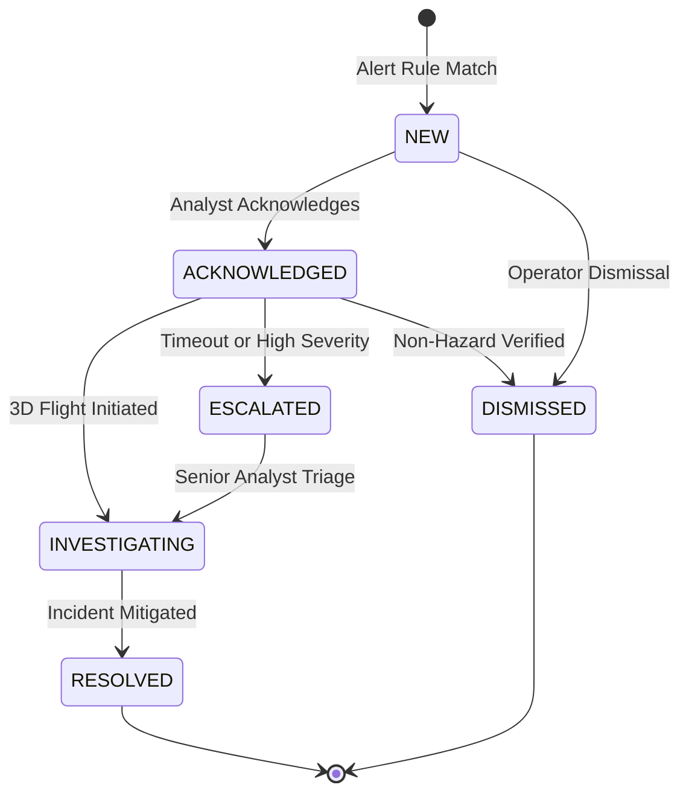

# InfernoX Architecture Overview

## Phase Status Summary

- **Phase 1 (Foundational GIS Architecture & Stack Setup):** Completed
- **Phase 2 (Automated Ingestion & Spatial Context Enrichment):** Completed
- **Phase 3 (Temporal Intelligence & AI Classification Prototype):** Completed
- **Phase 4 (Production Supervised ML & Satellite Intelligence):** Completed
- **Phase 5 (Event Investigation & Advanced 3D Mission Control):** Completed
- **Phase 6 (Risk, Alert & Response Engine):** Completed
- **Phase 7 (Analytics, Historical Intelligence & Professional Reporting):** Completed (Current Baseline)

---

## 1. System Pipeline Architecture

---

## 2. Core Architecture Subsystems

### A. Data Ingestion & Job Persistence
- **NASA FIRMS Pipeline**: Fetches thermal detections (VIIRS, MODIS), parses CSV, validates coordinates, and performs database deduplication using PostgreSQL `ON CONFLICT DO NOTHING` on `_thermal_event_uc`.
- **Persistent Ingestion Tracking**: Every execution creates and updates an `IngestionJob` record (`RUNNING`, `COMPLETED`, `PARTIAL`, `FAILED`), surviving restarts.
- **Safe Test/Demo Provider**: If `FIRMS_MAP_KEY` is not configured, the system logs configuration requirements and provides an explicit `DEMO_MODE` to avoid silent fake data substitution.

### B. Real Land-Cover Data (ESA WorldCover 10m)
Located in `backend/app/services/landcover/provider.py`.
- **Provider Abstraction**: `BaseLandCoverProvider` with production `WorldCoverProvider` implementation.
- **Release Version**: ESA WorldCover 10m `v200 (2021)`.
- **Class Mappings**:
  - Tree cover (10) -> `FOREST`
  - Shrubland (20) -> `FOREST`
  - Grassland (30) -> `BARE_LAND`
  - Cropland (40) -> `AGRICULTURE`
  - Built-up (50) -> `INDUSTRIAL/BUILT`
  - Bare / sparse vegetation (60) -> `BARE_LAND`
  - Snow and ice (70) -> `OTHER`
  - Permanent water bodies (80) -> `WATER`
  - Herbaceous wetland (90) -> `WATER`
  - Mangroves (95) -> `FOREST`
  - Moss and lichen (100) -> `BARE_LAND`
- **3-Degree Tile Indexing**: Computes exact 3x3 degree tile identifiers (e.g. `N18E072` for Mumbai at 19.0°N, 72.8°E) with global grid resolution.

### C. Satellite Remote Sensing (Sentinel-2 MSI)
Located in `backend/app/services/satellite/provider.py`.
- **Provider Abstraction**: `BaseSatelliteProvider` with concrete `Sentinel2Provider`.
- **STAC Search**: Queries public STAC APIs for Level-2A bottom-of-atmosphere surface reflectance scenes matching event coordinates and temporal windows (+/- 10 days).
- **Cloud Cover Thresholding**: Configurable `MAX_SATELLITE_CLOUD_COVER` (default 30%). Scenes exceeding the threshold are marked `satellite_evidence_available = False` with explicit rejection reasons.
- **Derived Spectral Indices**:
  - **NDVI** (Normalized Difference Vegetation Index): $(NIR - Red) / (NIR + Red)$
  - **NBR** (Normalized Burn Ratio): $(NIR - SWIR2) / (NIR + SWIR2)$
  - **NDWI** (Normalized Difference Water Index): $(Green - NIR) / (Green + NIR)$
  - **SWIR2/NIR Ratio**: $B12 / B08$ (combustion ratio, elevated in high-temperature anomalies).
  - **Burn Scar Indicator**: Detected when NBR < 0.10.

### D. Temporal Intelligence Engine
Located in `backend/app/services/temporal/analyzer.py`.
- **Spatial Clustering**: Groups thermal observations within a configurable radius (default 1,000m) over a historical lookback window (default 90 days).
- **Event States**:
  - `NEW`: Single or very recent observation with little history.
  - `RECURRING`: Repeated detections over multiple dates.
  - `PERSISTENT`: Long-term continuous activity (>= 5 active days).
  - `ABNORMAL`: Current thermal intensity significantly exceeds historical baseline (>= 2.5x mean FRP).

### E. Anti-Leakage Dataset Builder & ML Pipeline
Located in `backend/app/services/ml/dataset.py` and `backend/app/services/ml/trainer.py`.
- **Label Sources**:
  1. `ANALYST`: Analyst-confirmed events from Human-in-the-Loop review logs.
  2. `AUTHORITATIVE_DATASET`: Verified gas flares (World Bank GGFR catalog), industrial incidents, wildfire perimeters, and agricultural stubble burning perimeters.
- **Data Leakage Prevention**: Uses `GroupShuffleSplit` on spatial `cluster_id` and facility name to strictly ensure that all observations belonging to the same thermal source or facility remain in either the train OR test split.
- **Model Architecture**: Tabular multi-class **XGBoost** classifier (`xgboost.XGBClassifier`) with native missing-value tolerance.
- **Evaluation Metrics**: Accuracy, Macro Precision, Macro Recall, Macro F1, Per-class Precision/Recall/F1, and Confusion Matrix.
- **Model Registry & Versioning**: Saves serialized artifacts and metadata to `models/<model_version>/` (e.g. `xgb-v1`).

### F. ML Inference Service & Explainability
Located in `backend/app/services/ml/classifier.py`.
- Implements `ClassifierInterface` to evaluate standard classes:
  - `INDUSTRIAL_FIRE`, `GAS_FLARE`, `PERSISTENT_INDUSTRIAL_THERMAL_SOURCE`, `WILDFIRE`, `AGRICULTURAL_BURNING`, `MINING_ACTIVITY`, `OTHER_THERMAL_ANOMALY`, `UNKNOWN`.
- **Feature Importance Attributions**: Combines global model weights with event feature values to return ranked top contributing features.
- **Distinction of Confidence**: Clearly distinguishes raw `model_probability` from validated probabilities.
- **Safe Fallback**: If the production model is not operational, gracefully falls back to the Phase 3 prototype classifier with explicit source labeling.

### G. Priority Engine
Located in `backend/app/services/priority/engine.py`.
- Decouples classification ("What is it?") from operational urgency ("How urgently should an analyst investigate?").
- Evaluates FRP spikes, hazard proximity, and classification severity into `CRITICAL`, `HIGH`, `MEDIUM`, `LOW`.

---

## 3. Complete API Specification

### G. Analytical Risk Engine (`RiskEngine`)
Located in `backend/app/services/risk/engine.py`.
- **Purpose**: Computes a normalized **0–100 analytical risk score** decoupled from ML classification.
- **Thresholds**:
  - `0–24 LOW`: Routine thermal activity, low energy, far from infrastructure.
  - `25–49 MODERATE`: Elevated anomaly or agricultural burning near infrastructure.
  - `50–74 HIGH`: Persistent combustion, flare excursion, or industrial zone anomaly.
  - `75–100 CRITICAL`: Industrial fire, catastrophic FRP excursion, or volatile petrochemical proximity.
- **5-Factor Breakdown**:
  - Classification Impact (0–25 pts)
  - Thermal Radiative Power / FRP Intensity (0–25 pts)
  - Temporal Behavior & Persistence (0–20 pts)
  - Infrastructure & Hazard Proximity (0–20 pts)
  - Satellite Remote Sensing Confirmation (0–10 pts)
- **Model Versioning**: Stored with `risk_model_version = "risk-v1"` and full input snapshot in `risk_assessments` table for historical recalculation tracking.

### H. Configurable Alert Engine (`AlertEngine`)
Located in `backend/app/services/alert/engine.py`.
- **Safe Rule Matching**: Structured conditions evaluated without arbitrary code execution (`eval()`).
- **Cooldown Deduplication Window**: Prevents alert flooding for identical thermal events within a configurable cooldown period (e.g. 60 minutes).
- **Incident Payload**: Builds comprehensive analytical package for future Phase 7 reporting.

### I. Response Routing Service
Located in `backend/app/services/routing/service.py`.
- **Authority Directory**: Configured contacts (`response_contacts`) for fire emergency, disaster management, industrial safety, and facility operators.
- **Safe Operation**: Returns recommended recipient categories without claiming official unverified government status.

### J. Notification Architecture
Located in `backend/app/services/notification/`.
- **Active Provider**: `InAppNotificationProvider` persists delivered notifications to `notification_logs` for real-time header bell drawer.
- **Guarded Providers**: `EmailNotificationProvider`, `WebhookNotificationProvider`, and `SMSNotificationProvider` implement strict `integration_enabled = False` safety guards.

---

## 3. Endpoints Matrix

| Endpoint | Method | Purpose |
| :--- | :--- | :--- |
| `/api/v1/health` | GET | Service health check |
| `/api/v1/alerts` | GET | Paginated alerts with severity and status filters |
| `/api/v1/alerts/{id}` | GET | Detailed alert record, incident payload, and audit log |
| `/api/v1/alerts/{id}/acknowledge` | POST | Operator alert acknowledgement |
| `/api/v1/alerts/{id}/investigate` | POST | Transitions alert to `INVESTIGATING` |
| `/api/v1/alerts/{id}/escalate` | POST | Escalates alert priority with justification |
| `/api/v1/alerts/{id}/resolve` | POST | Resolves alert with closure comments |
| `/api/v1/alerts/{id}/dismiss` | POST | Dismisses false alarm with audit trail |
| `/api/v1/alerts/stats/summary` | GET | Aggregate alert counts by severity & state |
| `/api/v1/events/{id}/risk` | GET | Computes 0–100 risk score and factor breakdown |
| `/api/v1/events/{id}/risk/history` | GET | Historical recalculation cycles for event |
| `/api/v1/events/{id}/routing` | GET | Recommended response authority & action |
| `/api/v1/alert-rules` | GET / POST | List and create alert evaluation rules |
| `/api/v1/notifications` | GET | List delivered in-app alert notifications |
| `/api/v1/notifications/{id}/read` | POST | Mark in-app notification as read |
| `/api/v1/notifications/preferences` | GET / PUT | Analyst notification subscription preferences |
| `/api/v1/events/geojson` | GET | GeoJSON FeatureCollection of thermal events |
| `/api/v1/events/{id}/investigation` | GET | Consolidated event investigation dossier |
| `/api/v1/events/{id}/timeline` | GET | Chronological cluster detection history |
| `/api/v1/events/{id}/evidence` | GET | Sentinel-2 spectral indices and scene metadata |
| `/api/v1/events/{id}/nearby-facilities` | GET | Ranked industrial facilities within proximity |
| `/api/v1/events/{id}/status` | PATCH | Event lifecycle state transition |
| `/api/v1/events/compare` | GET | Side-by-side analytical comparison of two events |
| `/api/v1/facilities/{id}/investigation` | GET | Industrial facility context dossier & metrics |
| `/api/v1/search` | GET | Multi-entity global search across IDs, facilities |
| `/api/v1/analytics/overview` | GET | Executive KPI summary across events, classifications, risk, alerts |
| `/api/v1/analytics/timeseries` | GET | Chronological telemetry with interval aggregation (hour/day/week/month) |
| `/api/v1/analytics/classifications` | GET | AI classification distribution, confidence, and mean FRP |
| `/api/v1/analytics/risk` | GET | Risk score histogram and 4-tier distribution |
| `/api/v1/analytics/alerts` | GET | Alert lifecycle funnel, escalation rate %, and MTTR |
| `/api/v1/analytics/facilities` | GET | Monitored infrastructure ranked by thermal incident frequency |
| `/api/v1/analytics/facilities/{id}` | GET | Chronological thermal timeline for specific facility |
| `/api/v1/analytics/geospatial` | GET | PostGIS grid binning (0.05°–2.0°) with polygon GeoJSON heatmap |
| `/api/v1/analytics/comparison` | GET | Factual side-by-side comparison (Facility vs Facility, Period vs Period) |
| `/api/v1/analytics/trends` | GET | Statistical trend evaluation against prior equivalent window |
| `/api/v1/analytics/anomalies` | GET | Statistical anomaly feed identifying thermal excursions >= 2.5x baseline |
| `/api/v1/reports/generate` | POST | Generate intelligence report in requested format (PDF/CSV/GEOJSON/JSON) |
| `/api/v1/reports/incident/{id}` | GET | Incident investigation dossier payload |
| `/api/v1/reports/facility/{id}` | GET | Monitored facility thermal intelligence report payload |
| `/api/v1/reports/executive` | GET | Executive summary briefing payload aggregating national operations |
| `/api/v1/reports/regional` | GET | Regional intelligence assessment for an operational corridor |
| `/api/v1/reports/history` | GET | Historical audit archive of previously generated reports |

---

## 4. Frontend Mission Control, Analytics & Report Studio

- **Framework**: Next.js 14 App Router, CesiumJS, Tailwind CSS, Lucide icons.
- **Phase 6 Components**:
  - `AlertCenter`: Mission-control triage workspace featuring 4-tier severity KPI summary cards, status filters, search, incident payload dossier, and action toolbar.
  - `RiskCard`: Embedded radial score gauge (0–100), severity badge, and 5-factor contribution accordion with analytical explanations.
  - `NotificationDrawer`: In-app notification slide-over displaying real-time delivered alerts with direct click-to-investigate links.
  - `AlertPreferencesModal`: Operator configuration modal for subscribed severities, categories, and delivery channels.
  - `CesiumMap Alert Overlay`: 4-tier non-color visual indicators (`🛑`, `🔶`, `⚠️`, `🟢`, labels `[CRIT]`/`[HIGH]`/`[MOD]`/`LOW`, pixel sizes 8–16px, outline widths 1.5–3.5px).
- **Phase 7 Components**:
  - `AnalyticsDashboard`: Operations telemetry dashboard featuring real-time KPI strip, interactive SVG time-series charts with hover inspector, AI classification distributions, risk score histograms, alert lifecycle funnel, facility thermal ranking table, statistical anomaly feed, and side-by-side comparison modal.
  - `ReportBuilder`: Publication studio featuring report type template selection (Incident, Facility, Regional, Executive), parameter scoping, section checklist, live interactive document preview, export triggers (**PDF** via ReportLab, **CSV**, **GeoJSON**, **JSON**), and historical audit archive.
  - `CesiumMap Heatmap Grid Overlay`: Analytical PostGIS spatial density grid layer toggle with dynamic FRP/density alpha coloring.

---

## 5. Lifecycle State Machines

### A. Event Status Lifecycle

### B. Alert Lifecycle State Machine

